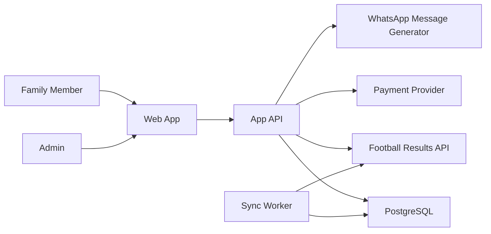

# World Cup Family Pool App / App Familiar de Polla Mundial

Private, family-friendly single-match exact-score pool for the FIFA World Cup.

App privada y familiar para apostar solo al marcador exacto de un partido del Mundial.

Production domain / Dominio de produccion: `https://polla.melazausa.com`

> Important: this should be positioned as a private family pool, not a public gambling platform. Keep access invite-only, avoid house profit, avoid minors participating with money, and confirm local rules before collecting or paying real money.
>
> Importante: esto debe manejarse como una polla privada familiar, no como una plataforma publica de apuestas. Mantener acceso por invitacion, sin ganancia para la casa, sin menores participando con dinero, y revisar las reglas locales antes de recolectar o pagar dinero real.

## 1. Product Summary / Resumen

The app lets family members join one selected World Cup match, predict the exact score, pay a fixed entry in COP or USD, and see the result settle automatically after the match ends.

La app permite que la familia entre a un solo partido seleccionado del Mundial, prediga el marcador exacto, pague una entrada fija en COP o USD, y vea el resultado liquidado automaticamente cuando termine el partido.

Fixed entry amount:

- 2,000 COP
- 1 USD

Core product rules:

- One active match only.
- Exact-score predictions only.
- Invite-only family access.
- Bilingual UI: Spanish and English.
- Fair payout accounting: every player contributes 2,000 COP to the main pot, even if they pay 1 USD.
- USD exchange-rate excess becomes a separate bonus for the best prediction score; ties split the bonus.
- In-app payment flow for COP and USD entries.
- Automatic score/result sync through a football results API.
- WhatsApp family group sharing for reminders, links, results, and winners.
- Manual admin override in case the API is delayed or incorrect.
- No complex odds, casino mechanics, ads, public betting, credit, or debt.

## 2. Example Match Flow / Flujo

```text
Admin creates pool / Admin crea la polla
  -> Selects World Cup match / Selecciona el partido
  -> Entry is fixed: 2,000 COP or 1 USD
  -> Shares invite link to family WhatsApp group

Family member joins / Familiar entra
  -> Enters name / Ingresa nombre
  -> Predicts exact score only / Predice solo marcador exacto
  -> Chooses COP or USD / Escoge COP o USD
  -> Pays in the app / Paga dentro de la app

Match is played / Se juega el partido
  -> API sync checks fixture status and final score
  -> App calculates exact-score winners
  -> App prepares WhatsApp group message
  -> Family sees final result, winners, and payout summary
```

## 3. Core Screens / Pantallas

### Home / Inicio

Shows the active match and pool status.

```text
Polla Mundial Familiar
Family World Cup Pool

Mexico vs South Africa
June 11, 2026 - Mexico City Stadium

Cierra en / Closes in: 02:14:33
Entrada / Entry: 2,000 COP or 1 USD
Participantes / Family joined: 12
Bolsa base / Base pot: 24,000 COP
Bono USD / USD excess bonus: 6,000 COP

[Entrar / Join]
[Ver Marcadores / View Predictions]
[Compartir por WhatsApp / Share on WhatsApp]
```

### Join Pool / Entrar

```text
Nombre / Your name
[________________]

Marcador exacto / Exact score
Mexico [ 2 ] - [ 1 ] South Africa

Moneda / Currency
[COP] [USD]

Entrada / Entry amount
2,000 COP

Metodo de pago / Payment method
[Tarjeta / Card] [Nequi] [Zelle] [PSE]

[Confirmar marcador / Confirm My Score]

Pago en la app / In-app payment
2,000 COP

[Pagar ahora / Pay now]
[Cancelar / Cancel]
```

### Family Predictions / Marcadores Familiares

```text
Marcadores Familiares / Family Predictions

Ana       Mexico 2-1 South Africa    Pagado / Paid
Carlos    Mexico 1-1 South Africa    Pagado / Paid
Mama      Mexico 2-0 South Africa    Pendiente / Pending
Diego     Mexico 0-1 South Africa    Pagado / Paid
```

Before kickoff, optionally hide exact picks to keep it fair.

Antes del inicio, se pueden ocultar los marcadores para mantenerlo justo.

### Result / Resultado

```text
Resultado Final / Final Result
Mexico 2 - 0 South Africa

Ganadores / Winners
Mama

Bolsa / Pot
Total collected: 24,000 COP + 3 USD
Base pot: 24,000 COP
USD excess bonus: 6,000 COP
Winner payout: 24,000 COP
Bonus payout: 6,000 COP

[Marcar como pagado / Mark as Paid]
[Enviar al WhatsApp / Send to WhatsApp]
[Exportar / Export]
```

## 4. Prediction Rules / Reglas

Only exact-score predictions are allowed.

Solo se permiten predicciones de marcador exacto.

Scoring:

| Prediction / Prediccion | Points / Puntos |
|---|---:|
| Exact score / Marcador exacto | 5 |
| Correct result only / Resultado correcto solamente | 2 |
| Incorrect result / Resultado incorrecto | 0 |

Example:

- Final score: Mexico 2-0 South Africa.
- Ana picked 2-0: 5 points.
- Carlos picked 1-0: 2 points.
- Diego picked 0-1: 0 points.

Highest score wins the base pot. If multiple people tie for highest score, they split the base pot equally.

Gana el puntaje mas alto. Si hay empate, se divide la bolsa base entre los ganadores.

USD excess rule:

- Every paid entry contributes exactly 2,000 COP to the base pot.
- If someone pays 1 USD, the app converts that payment to COP using the locked exchange rate.
- Any value above 2,000 COP is not added to the main pot.
- That excess becomes a separate USD bonus.
- The bonus goes to the family member with the best prediction score.
- If there is a tie for best prediction score, the bonus is split equally among those tied users.

Regla del exceso en USD:

- Cada entrada pagada aporta exactamente 2,000 COP a la bolsa base.
- Si alguien paga 1 USD, la app convierte ese pago a COP usando la tasa guardada.
- Cualquier valor por encima de 2,000 COP no se suma a la bolsa principal.
- Ese exceso se convierte en un bono separado.
- El bono va para el familiar con el mejor puntaje de prediccion.
- Si hay empate en el mejor puntaje, el bono se divide por partes iguales entre los empatados.

## 5. Currency Handling / Monedas

Supported currencies:

- COP
- USD

Fixed entry:

| Currency | Entry |
|---|---:|
| COP | 2,000 COP |
| USD | 1 USD |

Recommended behavior:

- Store all monetary values as integer minor units.
- COP uses whole pesos.
- USD uses cents.
- Save the exchange rate used when each person joins.
- Show original currency, base-pot contribution, and USD excess bonus.
- Do not silently recalculate old entries if the exchange rate changes.
- For payout fairness, count each paid entry as 2,000 COP toward the base pot.
- For USD payments, calculate excess as `max(copEquivalent - 2000, 0)`.

Example:

```json
{
  "currency": "USD",
  "amountMinor": 100,
  "fxRateToCop": 4000,
  "copEquivalent": 4000,
  "baseContributionCop": 2000,
  "excessContributionCop": 2000,
  "fxLockedAt": "2026-06-10T14:00:00Z"
}
```

## 6. Results API / API de Resultados

Recommended providers to evaluate:

- [football-data.org](https://www.football-data.org/documentation/quickstart): documented v4 API with match resources and filters.
- [API-Football](https://www.api-football.com/documentation-v3): broad football coverage, fixtures, scores, and live match data.
- [TheSportsDB](https://www.thesportsdb.com/free_sports_api): simpler sports API option, useful for prototypes.

Recommended sync:

```text
Every 5 minutes before kickoff:
  Sync fixture date, teams, venue, and status.

Every 1 minute during match:
  Sync live score and status.

Every 2 minutes after expected full time:
  Check for final status.

When status = FINISHED / Match Finished:
  Lock final score.
  Calculate exact-score points.
  Prepare WhatsApp group result message.
```

Admin override:

```text
Admin -> Match -> Edit Final Score -> Confirm Settlement
```

This avoids family drama if the API is late, has extra-time differences, or changes result status after review.

## 7. In-App Payments / Pagos en la App

The app includes a payment-session flow:

```text
1. Family member submits exact score.
2. App creates a payment session for 2,000 COP or 1 USD.
3. Member confirms payment inside the app.
4. Bet becomes PAID.
5. Only PAID bets count toward settlement.
```

Current local implementation:

- Uses a demo in-app payment provider.
- Supports the same UX shape as a real checkout.
- Stores payment records, status, method, amount, provider, and completion time.
- Lets pending users return and pay later.

Production provider options to evaluate:

- Wompi or Mercado Pago for Colombia-friendly COP payments.
- Stripe or PayPal for USD card payments where available.
- Manual Nequi/Zelle confirmation as a fallback if API access is not available.

Important production notes:

- Never store raw card details in this app.
- Use hosted checkout or tokenized payment provider components.
- Keep provider secret keys on the server only.
- Verify payment webhooks before marking a bet as paid.
- Keep the fixed payout rule: every paid user counts as 2,000 COP in the base pot; USD excess goes to the bonus.

Suggested payment statuses:

```text
PENDING -> REQUIRES_CONFIRMATION -> PAID
PENDING -> REQUIRES_CONFIRMATION -> CANCELLED
PAID -> REFUNDED
```

## 8. WhatsApp Group Messaging / Mensajes a WhatsApp

Goal: send updates to the family WhatsApp group chat.

Objetivo: enviar actualizaciones al grupo familiar de WhatsApp.

Practical implementation options:

1. MVP recommended: generate a WhatsApp share link/message that the admin sends to the group.
2. Semi-automated: app prepares the message, admin taps "Send to WhatsApp", selects the family group, and sends.
3. Fully automated: only use if a compliant provider supports the exact group workflow you need. Official WhatsApp Business APIs are generally designed for business-to-user messaging with opted-in individual recipients, so direct automated group-chat posting should be validated before building around it.

WhatsApp messages to generate:

### Pool Created

```text
Polla Mundial Familiar

Partido: Mexico vs South Africa
Entrada: 2,000 COP o 1 USD
Prediccion: marcador exacto
Cierre: antes del inicio del partido

Entra aqui:
https://polla.melazausa.com/?invite=FAMILIA2026
```

### Reminder

```text
Recordatorio: la polla cierra pronto.

Mexico vs South Africa
Entrada: 2,000 COP o 1 USD
Solo marcador exacto.

Link:
https://polla.melazausa.com/?invite=FAMILIA2026
```

### Final Result

```text
Resultado final:
Mexico 2 - 0 South Africa

Ganadores:
Mama

Bolsa total:
Bolsa base: 24,000 COP
Bono USD: 6,000 COP
```

## 9. Bilingual UX / Experiencia Bilingue

The app should support Spanish and English from the first version.

La app debe soportar espanol e ingles desde la primera version.

Recommended language behavior:

- Default language: Spanish.
- User can switch to English.
- Store language preference per browser or user.
- Use short paired labels where helpful: `Entrar / Join`.
- Keep WhatsApp messages in Spanish by default, with optional English version.

Example translation keys:

```json
{
  "pool.title": {
    "es": "Polla Mundial Familiar",
    "en": "Family World Cup Pool"
  },
  "entry.amount": {
    "es": "Entrada: 2,000 COP o 1 USD",
    "en": "Entry: 2,000 COP or 1 USD"
  },
  "prediction.exactScore": {
    "es": "Marcador exacto",
    "en": "Exact score"
  },
  "actions.join": {
    "es": "Entrar",
    "en": "Join"
  }
}
```

## 10. App Architecture / Arquitectura

Recommended stack:

- Frontend: Next.js or React
- Backend API: Next.js API routes, Express, or Fastify
- Database: PostgreSQL
- ORM: Prisma
- Auth: invite code plus optional PIN
- Jobs: background scheduler for result sync
- Payments: demo in-app provider for MVP; hosted checkout provider in production
- Messaging: WhatsApp share links for MVP, provider integration later if validated
- Hosting: Netlify, Vercel, Render, Railway, or a small VPS

High-level architecture:



## 11. Data Model / Modelo de Datos

```prisma
model User {
  id          String   @id @default(cuid())
  name        String
  phone       String?
  language    Language @default(ES)
  role        Role     @default(MEMBER)
  createdAt   DateTime @default(now())
  bets        Bet[]
}

model Pool {
  id              String     @id @default(cuid())
  title           String
  inviteCode      String     @unique
  status          PoolStatus @default(OPEN)
  entryCopMinor   Int        @default(2000)
  entryUsdMinor   Int        @default(100)
  closeAt         DateTime
  createdAt       DateTime   @default(now())
  match           Match?
  bets            Bet[]
  payments        Payment[]
}

model Match {
  id              String      @id @default(cuid())
  poolId          String      @unique
  provider        String
  providerMatchId String
  homeTeam        String
  awayTeam        String
  kickoffAt       DateTime
  venue           String?
  status          MatchStatus @default(SCHEDULED)
  homeScore       Int?
  awayScore       Int?
  finalAt         DateTime?
  pool            Pool        @relation(fields: [poolId], references: [id])
}

model Bet {
  id             String        @id @default(cuid())
  poolId         String
  userId         String
  homeScorePick  Int
  awayScorePick  Int
  currency       Currency
  amountMinor    Int
  fxRateToCop    Decimal?
  copEquivalent  Int
  baseContributionCop Int     @default(2000)
  excessContributionCop Int   @default(0)
  paymentProvider String?
  paymentId       String?
  paymentStatus  PaymentStatus @default(PENDING)
  paidAt         DateTime?
  points         Int?
  isWinner       Boolean       @default(false)
  isBonusWinner  Boolean       @default(false)
  createdAt      DateTime      @default(now())
  pool           Pool          @relation(fields: [poolId], references: [id])
  user           User          @relation(fields: [userId], references: [id])
}

model Payment {
  id            String        @id @default(cuid())
  poolId        String
  betId         String
  provider      String
  method        String
  status        PaymentStatus @default(PENDING)
  currency      Currency
  amountMinor   Int
  displayAmount String
  createdAt     DateTime      @default(now())
  completedAt   DateTime?
}

model WhatsAppMessage {
  id          String   @id @default(cuid())
  poolId      String
  type        MessageType
  language    Language
  body        String
  sentByAdmin Boolean  @default(false)
  createdAt   DateTime @default(now())
}

enum Role {
  ADMIN
  MEMBER
}

enum Language {
  ES
  EN
}

enum Currency {
  COP
  USD
}

enum PoolStatus {
  OPEN
  LOCKED
  SETTLED
  CANCELLED
}

enum MatchStatus {
  SCHEDULED
  LIVE
  FINISHED
  POSTPONED
  CANCELLED
}

enum PaymentStatus {
  PENDING
  REQUIRES_CONFIRMATION
  PAID
  CANCELLED
  REFUNDED
}

enum MessageType {
  POOL_CREATED
  REMINDER
  MATCH_STARTED
  RESULT
  SETTLEMENT
}
```

## 12. API Endpoints

### Public / Family

```http
GET    /api/pools/:inviteCode
POST   /api/pools/:poolId/join
POST   /api/payments/:betId/create
POST   /api/payments/:betId/confirm
POST   /api/payments/:betId/cancel
GET    /api/pools/:poolId/bets
GET    /api/pools/:poolId/result
GET    /api/i18n/:language
```

### Admin

```http
POST   /api/admin/pools
PATCH  /api/admin/pools/:poolId
POST   /api/admin/pools/:poolId/lock
POST   /api/admin/pools/:poolId/sync-result
POST   /api/admin/pools/:poolId/settle
PATCH  /api/admin/bets/:betId/payment
POST   /api/admin/pools/:poolId/whatsapp-message
```

### Example Join Request

```json
{
  "name": "Ana",
  "homeScorePick": 2,
  "awayScorePick": 1,
  "currency": "COP",
  "amountMinor": 2000,
  "paymentMethod": "CARD",
  "language": "ES"
}
```

## 13. Settlement Logic / Liquidacion

```ts
function scoreBet(bet, finalHome, finalAway) {
  const pickedHome = bet.homeScorePick;
  const pickedAway = bet.awayScorePick;

  if (pickedHome === finalHome && pickedAway === finalAway) return 5;

  const finalResult =
    finalHome > finalAway ? "HOME" :
    finalHome < finalAway ? "AWAY" :
    "DRAW";

  const pickedResult =
    pickedHome > pickedAway ? "HOME" :
    pickedHome < pickedAway ? "AWAY" :
    "DRAW";

  return finalResult === pickedResult ? 2 : 0;
}

function calculateMoneySplit(paidBets) {
  const basePotCop = paidBets.reduce(
    (sum, bet) => sum + bet.baseContributionCop,
    0
  );

  const usdExcessBonusCop = paidBets.reduce(
    (sum, bet) => sum + bet.excessContributionCop,
    0
  );

  return { basePotCop, usdExcessBonusCop };
}
```

Settlement steps:

```text
1. Confirm match status is final.
2. Lock pool if not already locked.
3. Score all paid bets.
4. Find highest score.
5. Mark all top scorers as base-pot winners.
6. Split the base pot evenly among top scorers.
7. Calculate USD excess bonus from USD payments only.
8. Give the USD excess bonus to the best prediction score.
9. If the best prediction score is tied, split the USD excess bonus among tied users.
10. Generate WhatsApp result message.
11. Show payout summary with base pot, USD bonus, and total payout.
```

## 14. Family-Friendly Guardrails

- Invite-only access.
- Exact score only.
- Fixed low entry: 2,000 COP or 1 USD.
- In-app payment required before a bet counts in the payout.
- No public betting or random users.
- No credit, loans, debt, or negative balances.
- No odds boosts, streak pressure, or manipulative notifications.
- Clear "for family fun" copy in Spanish and English.
- Admin can cancel and refund pool.
- Hide picks until kickoff if desired.
- Require payment confirmation before settlement.
- Keep a visible audit log of edits, messages, payments, and overrides.

## 15. MVP Build Plan

### Phase 1: Working Private Pool

- Create one pool.
- Join with name and exact score.
- Fixed COP/USD entry display.
- Spanish and English labels.
- Demo in-app payment checkout.
- Manual final score.
- Settlement summary.
- WhatsApp share message generator.

### Phase 2: API Integration

- Connect football results provider.
- Connect real payment provider and webhooks.
- Sync selected fixture.
- Auto-settle when final.
- Generate final WhatsApp message.
- Add admin override audit log.

### Phase 3: Polish

- Invite links.
- Mobile-friendly design.
- Language switcher.
- WhatsApp reminder templates.
- Export CSV.
- Simple family leaderboard.

## 16. Acceptance Criteria

The app is ready when:

- A family member can join from a phone in under 60 seconds.
- The only prediction option is exact score.
- Entry is fixed at 2,000 COP or 1 USD.
- A member can pay inside the app after submitting a score.
- Only paid bets count toward the settlement.
- The UI supports Spanish and English.
- The pool locks before kickoff.
- COP and USD entries are shown clearly.
- USD payments do not inflate the base pot; each player counts as 2,000 COP.
- USD exchange-rate excess is tracked as a separate bonus and split on tied top scores.
- Final score can come from API or admin override.
- Winners and payout split are transparent.
- The app generates WhatsApp group messages for invite, reminder, result, and settlement.
- No one can edit predictions after lock.
- The admin can export a full record of bets, payments, WhatsApp messages, and settlement.
